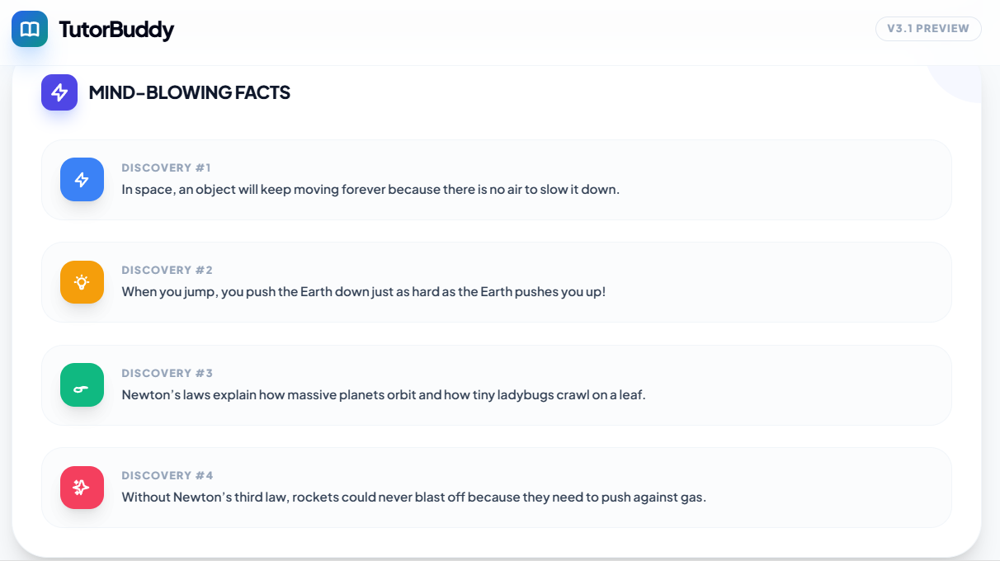
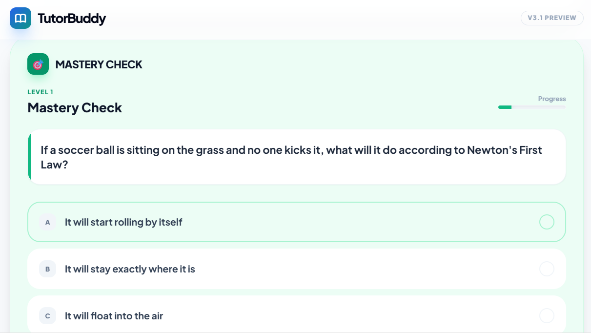
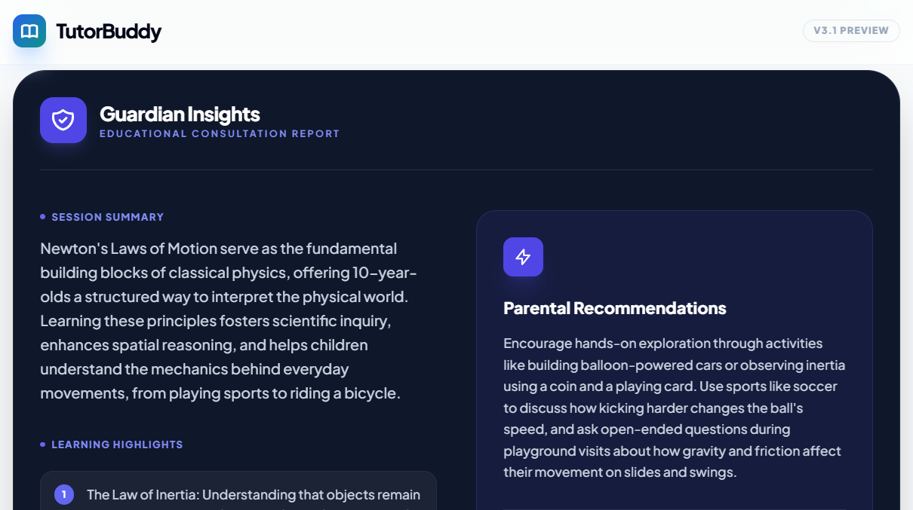
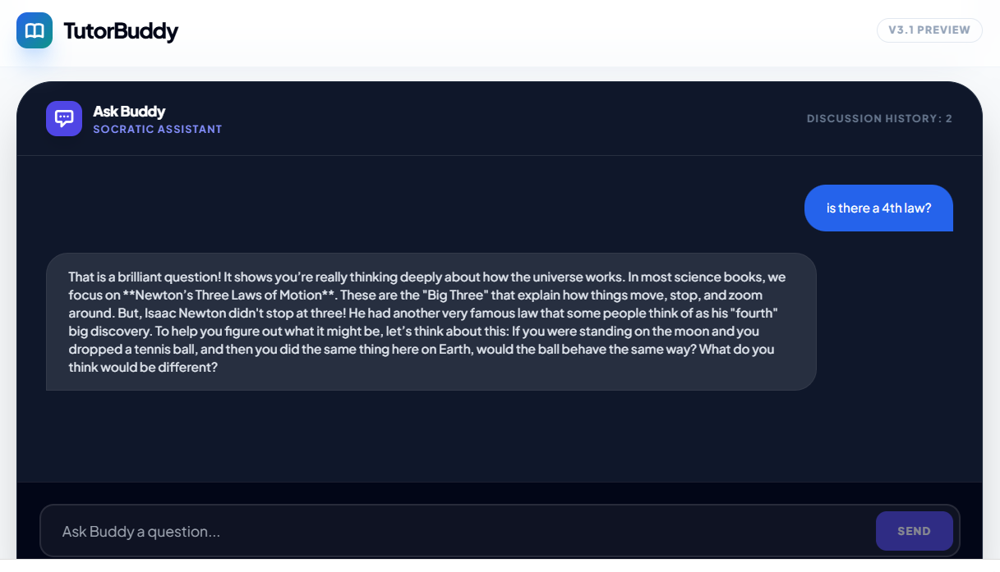

# 🧠 TutorBuddy: Agentic Mastery Platform

**TutorBuddy** is a world-class, agentic tutoring application designed to empower learners aged 5-17. By leveraging Google’s latest Gemini 3 Flash models, it transforms simple queries into a complete **Mastery Canvas**—comprising structured lessons, emotional audio dialogues, and adaptive quizzes.

## 🚀 Key Features

### 1. Multi-Modal Mastery Canvas
Every session generates a comprehensive learning dashboard:
- **Expert Tutorials**: Structured Markdown lessons generated by **Gemini 3 Flash**, optimized for readability with superior spacing and typography.
- **Visualizer Gallery**: A 5-part educational slideshow powered by **Gemini 2.5 Flash Image**.
- **Buddy & Sam Dialogue**: An emotional multi-speaker audio conversation about the topic, powered by **Gemini 2.5 Flash Native Audio (TTS)**.
- **Adaptive Quiz**: A 5-question mastery check to validate learning immediately.

### 2. Safety-First Architecture
TutorBuddy is built with high guardrails for child safety:
- **AI Pre-Check**: Every user query is analyzed by a safety classifier.
- **Safety Directives**: All generative prompts are hardened with strict neutrality and child-safety system instructions.

### 3. Subject-Specific Context
The platform provides specialized tutoring across academic disciplines:
- **Math**, **Science**, **Latin**, **English**, **Geography**.

## 🛠️ Technology Stack

| Component | Model / Technology | Purpose |
| :--- | :--- | :--- |
| **Reasoning & Text** | `gemini-3-flash-preview` | Tutorial, Quiz, and Report generation |
| **Audio (TTS)** | `gemini-2.5-flash-preview-tts` | Multi-speaker emotional educational dialogues |
| **Image Generation** | `gemini-2.5-flash-image` | 5-part educational visual galleries |
| **Safety Logic** | `gemini-3-flash-preview` | Input validation |
| **Frontend** | React 19 + Tailwind CSS | Responsive, high-performance UI |

## 🔑 Setup & Privacy

TutorBuddy operates on a **BYOK (Bring Your Own Key)** model. API keys are handled securely via the provided studio interface.

## 📸 Sample Output

### Application Screenshots

*Initial query input and topic selection interface*

*Generated tutorial content with structured markdown lessons*

*Interactive quiz component for mastery validation*

*Comprehensive learning report with performance analytics*

### Demo Video

*Click the image above to watch a complete demonstration of TutorBuddy in action*

---
*Developed by Senior Frontend Engineering Team*