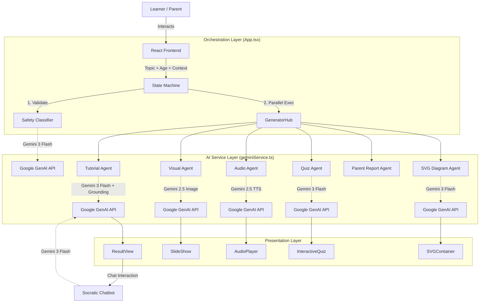

# 🏗️ TutorBuddy Architecture

## System Overview

TutorBuddy is a **Client-Side Agentic Application**. It relies on a "Thick Client" architecture where the React frontend acts as the primary orchestrator, communicating directly with Google's GenAI APIs. This ensures low latency and high privacy (data resides in the browser session).

## 🧩 Component Architecture



## 🔄 Data Flow: The "Mastery Canvas" Generation

When a user clicks "Generate", the system executes an **Agentic Workflow**:

1.  **Input Parsing**: The app accepts Topic, Subject, Age, and optional `Context Image` (OCR).
2.  **Safety Guard**: `validateTopicSafety` is called. If flagged unsafe/political/harmful, execution halts.
3.  **Parallel Generation Strategy**: To minimize user wait time, we fire independent promises simultaneously:
    *   **Promise A**: Lesson Text + Search Grounding (The core content).
    *   **Promise B**: Quiz Generation (JSON structured).
    *   **Promise C**: Fun Facts (JSON structured).
    *   **Promise D**: Visual Aids (4x Images via Gemini 2.5).
    *   **Promise E**: Educational Diagram (SVG Code via Gemini 3).
    *   **Promise F**: Parent Report (Hidden from learner, stored for parent).
4.  **State Rehydration**: As promises resolve, the UI updates incrementally (Loading skeletons -> Content).
5.  **Lazy Generation**: High-bandwidth assets (Audio TTS) are generated only on-demand (when user clicks "Play") or pre-fetched in background if bandwidth allows.

## 💾 Data Models & States

### App States
The application follows a strict state machine to manage the generation lifecycle:
- `IDLE`: Landing page and form input.
- `PROCESSING`: Orchestrating AI agents (Safety Check -> Content Gen).
- `RESULT`: Displaying the Mastery Canvas.
- `ERROR`: Handling API limits or safety blocks.

### LearningContent Interface
The core data structure holding the session state.

```typescript
interface LearningContent {
  topic: string;
  subject: string;
  ageGroup: number;
  explanation: string;      // Markdown from Gemini 3
  groundingSource: [];      // Google Search citations
  images: string[];         // Base64 PNGs from Gemini 2.5
  quizQuestions: Question[];// Structured JSON
  parentReport: Report;     // Structured JSON
  diagram: string;          // Raw SVG string
  contextImage?: string;    // Base64 User Upload
}
```

## 🛡️ Safety & Grounding
*   **System Instructions**: All API calls inject a `SAFETY_DIRECTIVE` ensuring neutrality and age-appropriateness.
*   **Grounding**: The Tutorial Agent utilizes `{ tools: [{ googleSearch: {} }] }` to ensure facts (e.g., "Population of Mars") are current and hallucination is minimized.
