# 🗺️ User Experience Flows

## 1. The Setup (Onboarding)
**Goal**: Capture intent and context with minimal friction.


## 2. The Learning Loop
**Goal**: Engage multiple senses to reinforce the concept.

```mermaid
graph LR
    Start((Canvas Loaded)) --> Read[Read Tutorial]
    Read --> Grounding{Check Sources}
    Grounding -->|Valid| Visualize[View Image Gallery]
    Visualize --> Diagram[Interact with SVG Diagram]
    Diagram --> Listen[Play Audio Dialogue]
    
    Listen --> Chat[Ask Buddy (Chat)]
    Chat --> DeepDive[Click 'Deep Dive' Suggestion]
    DeepDive --> MicroLesson[View Micro-Lesson Overlay]
    
    MicroLesson --> Quiz[Take Mastery Quiz]
    Chat --> Quiz
```

## 3. The Validation (Quiz & Report)
**Goal**: Verify knowledge and inform guardians.

```mermaid
sequenceDiagram
    participant Learner
    participant QuizUI
    participant ParentUI
    participant FileSystem
    
    Learner->>QuizUI: Answers 5 Questions
    QuizUI-->>Learner: Immediate Feedback (Audio + Visual)
    
    alt Score > 80%
        QuizUI-->>Learner: Show Gold Trophy 🏆
    else Score < 50%
        QuizUI-->>Learner: Encouragement Message
    end
    
    Learner->>FileSystem: Clicks "Download Full Mastery Pack"
    FileSystem-->>Learner: Generates .ZIP (Markdown + Images + Audio + Report)
    
    Note over ParentUI: Parent reviews generated "Guardian Insights" section
```


